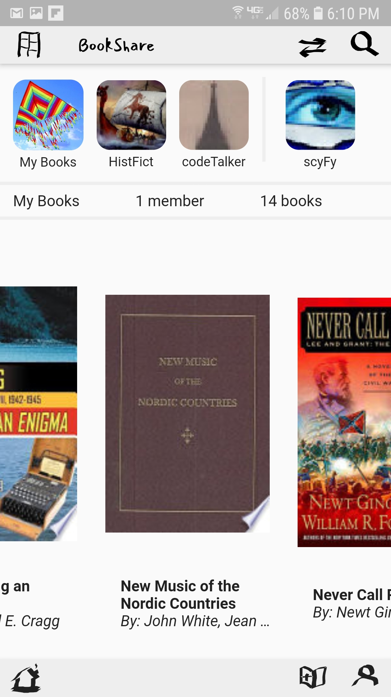
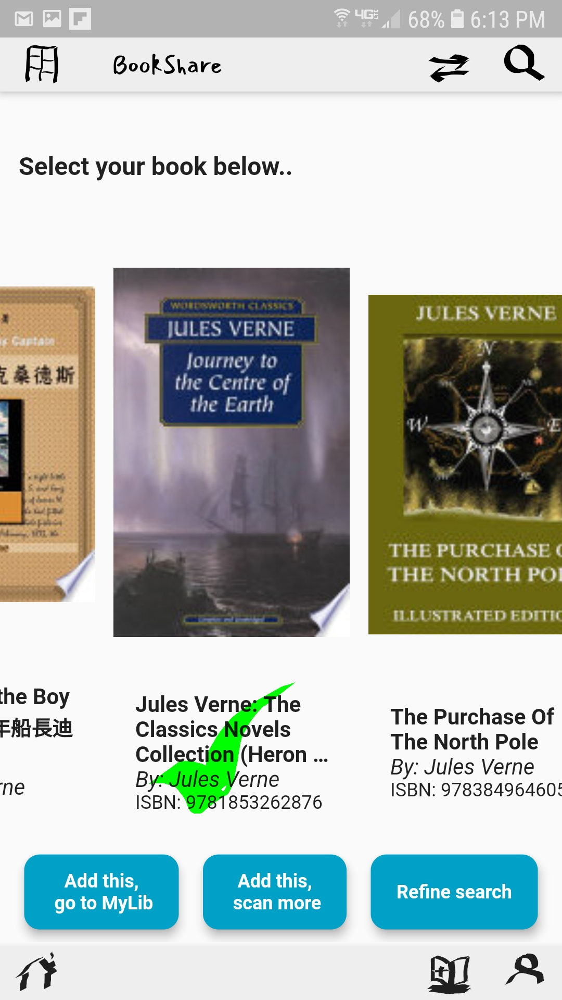
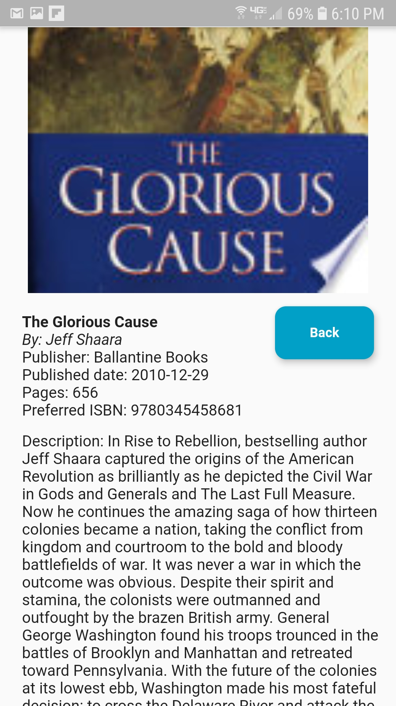
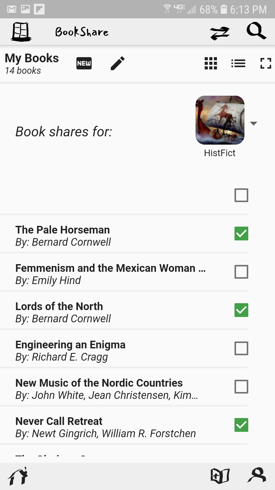

# BookShare Project

The BookShare project helps create and run small private libraries
shared between small groups of people.  BookShare is composed of three
major elements:

 * a flutter-based mobile app, or **BookShare App**; 
 * a serverless AWS backend, or **BookShare Backend**; and
 * a shared equity model for contributors, or **CodeEquity for BookShare**.

# BookShare App

BookShare is an easy to use app for organizing a private library
between a small group of people.  With BookShare, you can add your own
contributions to a library by scanning the barcode with your phone.
You can join libraries of people you know.  You can also locate and
request books your libraries that currently reside with other members.

For example, a bookclub can use BookShare to keep track of who
currently has which books on the reading list for the summer.

For example, an extended family can share all the Warriors books
between the cousins.

For example, a language school typically has a very interested, active
community of families, together with a rich but inaccessible trove of
foreign language books.  Bookshare helps the school by making it easy
to share and track any book that a participating member is willing to
loan out to the community.

  
  &nbsp;&nbsp;&nbsp;&nbsp;&nbsp;&nbsp
  
  &nbsp;&nbsp;&nbsp;&nbsp;&nbsp;&nbsp
  

:-------------------------:|:-------------------------:|:-------------------------:
   |
   |
  

:-------------------------:|:-------------------------:|:-------------------------:
   |  | 

# BookShare Backend

# CodeEquity for BookShare

Details coming soon!

# Status 3/1/20

 * **BookShare App Status**
 * **BookShare Backend Status**
 * **CodeEquity for BookShare Status **

STATUS 10/23/19:
 * AWS infrastructure creation in createBS.py is in reasonable shape.
   Python script runs AWS SAM and Cloudformation templates and
   commands through boto3 and the command line interface.
   Infrastucture includes: 
   - S3 deployment bucket
   - S3 bucket set up for static web site
   - Cognito user pool authentication
   - API + Lambda stub using dynamo
   - DynamoDB
   - Cloudwatch
   - all necessary IAM roles

  CreateBS.py requires a functional boto/awscli/awssam environment as
  detailed here: https://docs.aws.amazon.com/serverless-application-model/latest/developerguide/serverless-sam-cli-install.html
  The script includes functionality to set this up for a Linux build,
  but it is not well-tested.

 * Bookshare App:  EARLY STAGES, work in progress.

 * App development:  Flutter, on Android emulator for Nexus IV
   with API 27.

# Developer Quickstart

# Known Issues

Visit the Issue page in this repository for known issues and feature requests.

# Release History

# Contributing

See the [CONTRIBUTING](CONTRIBUTING.md) file for how to contribute.

# License

See the [LICENSE](LICENSE) file for our project's licensing.

Copyright 2019 Amazon.com, Inc. or its affiliates. All Rights Reserved.

Unless required by applicable law or agreed to in writing, software distributed under the License is distributed on an "AS IS" BASIS, WITHOUT WARRANTIES OR CONDITIONS OF ANY KIND, either express or implied. 

NOTE: Set environment variable BSPATH to this github project directory.

