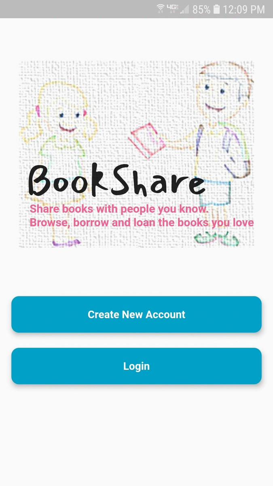
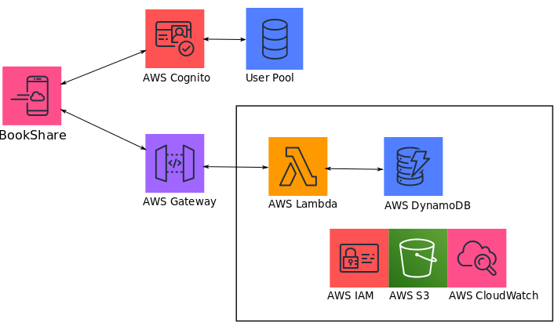

# BookShare Project

The BookShare project helps create and run small private libraries
shared between small groups of people.  BookShare is composed of three
major elements:

 * a flutter-based mobile app, or **BookShare App**; 
 * a serverless AWS backend, or **BookShare Backend**; and
 * a shared equity model for contributors, or **CodeEquity for BookShare**.

# BookShare App

BookShare helps organize private libraries between a small group of
people.  With BookShare, you add your own contributions to a library
by scanning the book's barcode with your phone.  You can join
libraries of people you know.  You can also locate and request books
in your libraries that currently reside with other members.

For example, a bookclub can use BookShare to keep track of who
currently has which books on the reading list for the summer.

For example, an extended family can share all the Warriors books
between the cousins.

For example, a language school may have a very interested, active
community of families, together with a rich but inaccessible trove of
foreign language books.  Bookshare makes it easy to share and track
any book that a participating member is willing to loan out to the
community.

The following gif shows screens including: home; scan a book; refine
search and choose; check details; share book with a member library;
visit a non-member library.

  &nbsp;&nbsp;&nbsp;&nbsp;&nbsp;&nbsp;&nbsp;&nbsp;&nbsp;&nbsp;&nbsp;&nbsp
  

 

# BookShare Backend

The BookShare backend is a _serverless_ architecture on AWS.  The
architecture is specified with a [yaml
file](bookShareApp/samInfrastructure.yaml) that is a mixture of AWS's
SAM and CloudFormation specifications.  The following diagram is an
overview of the major components in the backend, and how they interact.

  &nbsp;&nbsp;&nbsp;&nbsp;&nbsp;&nbsp;&nbsp;&nbsp;&nbsp;&nbsp;&nbsp;&nbsp
  

 

# CodeEquity for BookShare

Details coming soon!

# Developer Quickstart

Create or destroy the BookShare Backend infrascture with
[createBS.py](bookShareApp/createBS.py), for example:
* python createBS.py help
* python createBS.py makeBSResources

Carry out integration testing with
[runTests.py](bookShareApp/runTests.py), for example:
* python runTests.py

runTests.py carries out several minutes of integration testing using the Android emulator for
Nexus IV with API 27.

Main development components for both the app and the backend include: 
* flutter, master channel  v1.16+
* android studio, v3.6+
* javascript, for AWS lambda 
* python 3.6.7+
* aws development environment with boto/awscli/awssam as detailed
here: https://docs.aws.amazon.com/serverless-application-model/latest/developerguide/serverless-sam-cli-install.html

# Known Issues

Visit the Issue page in this repository for known issues and feature requests.

# Status 3/1/20

 * **BookShare App Status**
 * **BookShare Backend Status**
 * **CodeEquity for BookShare Status **

STATUS 10/23/19:
 * AWS infrastructure creation in createBS.py is in reasonable shape.
   Python script runs AWS SAM and Cloudformation templates and
   commands through boto3 and the command line interface.
   Infrastucture includes: 
   - S3 deployment bucket
   - S3 bucket set up for static web site
   - Cognito user pool authentication
   - API + Lambda stub using dynamo
   - DynamoDB
   - Cloudwatch
   - all necessary IAM roles

  CreateBS.py requires a functional boto/awscli/awssam environment as
  detailed here: https://docs.aws.amazon.com/serverless-application-model/latest/developerguide/serverless-sam-cli-install.html
  The script includes functionality to set this up for a Linux build,
  but it is not well-tested.

 * Bookshare App:  EARLY STAGES, work in progress.

 * App development:  Flutter, on Android emulator for Nexus IV
   with API 27.

# Release History

# Contributing

See the [CONTRIBUTING](CONTRIBUTING.md) file for how to contribute.

# License

See the [LICENSE](LICENSE) file for our project's licensing.

Copyright 2019 Amazon.com, Inc. or its affiliates. All Rights Reserved.

Unless required by applicable law or agreed to in writing, software distributed under the License is distributed on an "AS IS" BASIS, WITHOUT WARRANTIES OR CONDITIONS OF ANY KIND, either express or implied. 

NOTE: Set environment variable BSPATH to this github project directory.

